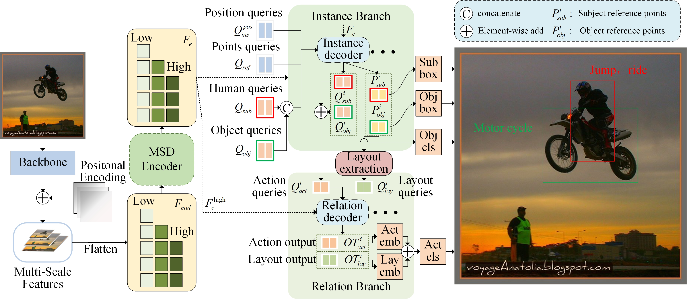

# ILCN
This page is the code of our paper (in submission) "Intra-and-inter Instance Location Correlation Network for Human Object Interaction Detection".



## Installation
Our model is run under ```CUDA>=9.2, GCC>=5.4,Python>=3.7  ```. Other versions might be available as well.

1. Clone this repo
```sh
git clone https://github.com/lumao23/ILCN.git
cd ILCN
```

2. Install Pytorch and torchvision
```sh
conda create -n ILCN python=3.8
conda activate ILCN
pip install -r requirements.txt
conda install pytorch==1.11.0 torchvision==0.12.0 torchaudio==0.11.0 cudatoolkit=11.3 -c pytorch
```
Or you can follow the instruction on https://pytorch.org/get-started/locally/ for another pytorch version

2. Compiling CUDA operators
```sh
cd models/ops
python setup.py build install
# unit test (should see all checking is True)
python test.py
cd ../..
```

## Data

### hico-det
please download [hico-det](https://websites.umich.edu/~ywchao/hico/) and arrage them as following:
```
data
├── hico_20160224_det
|   ├── images
|   |   ├── test2015
|   |   └── train2015
|   └── annotations
|       ├── anno_list.json
|       ├── corre_hico.npy
|       ├── file_name_to_obj_cat.json
|       ├── hoi_id_to_num.json
|       ├── hoi_list_new.json
|       ├── test_hico.json
|       └── trainval_hico.json
```
### v-coco
the preparation of v-coco requires python2, and please follow [v-coco](https://github.com/s-gupta/v-coco)

For evaluation, please put `vcoco_test.ids` and `vcoco_test.json` into `data/v-coco/data`.

After preparation, the data/v-coco folder as follows:
```
data
├── v-coco
|   ├── prior.pickle
|   ├── images
|   |   ├── train2014
|   |   └── val2014
|   ├── data
|   |   ├── instances_vcoco_all_2014.json
|   |   ├── vcoco_test.ids
|   |   └── vcoco_test.json
|   └── annotations
|       ├── corre_vcoco.npy
|       ├── test_vcoco.json
|       └── trainval_vcoco.json
```

## Test
Our results are provided here as well as pre-trained parameters.
### hico-det
<table><tbody>
<!-- START TABLE -->
<!-- TABLE HEADER -->
<th valign="bottom">Name</th>
 <th valign="bottom">pretrain</th>
<th valign="bottom">Backbone</th>
<th valign="bottom">query</th>
<th valign="bottom">epochs</th>
<th valign="bottom">Full(def)</th>
 <th valign="bottom">Rare(def)</th>
 <th valign="bottom">non-rare(def)</th>
<th valign="bottom">download</th>
<!-- TABLE BODY -->
 <tr><td align="left"><a href="https://github.com/lumao23/ILCN/blob/main/hico_tools/train_hico_swin_all_3dec_3numfeat_ImageNet.sh">ILCN</a></td>
<td align="center"><a href="https://github.com/SwinTransformer/storage/releases/download/v1.0.0/swin_tiny_patch4_window7_224.pth">w\o pre-train</a></td>
<td align="center">swin-tiny</td>
<td align="center">128</td>
<td align="center">100</td>
<td align="center">30.76</td>
<td align="center">25.47</td>
<td align="center">32.34</td>
<td align="center"><a href="https://drive.google.com/drive/u/1/folders/1AtQVLvNIRqv5-yh-YEKgq9d-Y5vkV1Pp">model</a></td>
 <tr><td align="left"><a href="https://github.com/lumao23/ILCN/blob/main/hico_tools/train_hico_swin_all_6dec_4numfeat_COCO.sh">ILCN<a/></td>
<td align="center"><a href="https://drive.google.com/drive/u/1/folders/1NVror7POAtsqQZUfQGg-2jbON9PTWzW2">pre-train</a></td>
<td align="center">swin-tiny</td>
<td align="center">128</td>
<td align="center">100</td>
<td align="center">33.80</td>
<td align="center">29.83</td>
<td align="center">34.99</td>
<td align="center"><a href="https://drive.google.com/drive/u/1/folders/1mBhwv_R7pydwKHhwdDglzMdXng6H03nQ">model</a></td>
</tbody></table>
  
The official evaluation steps can be seen in [PPDM](https://github.com/YueLiao/PPDM.com) and [HO-RCNN](https://github.com/ywchao/ho-rcnn.com)

### v-coco
<table><tbody>
<!-- START TABLE -->
<!-- TABLE HEADER -->
<th valign="bottom">Name</th>
 <th valign="bottom">pretrain</th>
<th valign="bottom">Backbone</th>
<th valign="bottom">query</th>
<th valign="bottom">epochs</th>
<th valign="bottom">mAP_all</th>
 <th valign="bottom">mAP_thesis</th>
<th valign="bottom">download</th>
<!-- TABLE BODY -->
 <tr><td align="left"><a href="https://github.com/lumao23/ILCN/blob/main/vcoco_tools/train_vcoco_swin_all_6dec_4numfeat_ImageNet.sh">ILCN</a></td>
<td align="center"><a href="https://github.com/SwinTransformer/storage/releases/download/v1.0.0/swin_tiny_patch4_window7_224.pth">w\o pre-train</a></td>
<td align="center">swin-tiny</td>
<td align="center">128</td>
<td align="center">100</td>
<td align="center">53.15</td>
<td align="center">52.97</td>
<td align="center"><a href="https://drive.google.com/drive/u/1/folders/1AtQVLvNIRqv5-yh-YEKgq9d-Y5vkV1Pp">model</a></td>
 <tr><td align="left"><a href="https://github.com/lumao23/ILCN/blob/main/vcoco_tools/train_vcoco_swin_all_6dec_4numfeat_COCO.sh">ILCN<a/></td>
<td align="center"><a href="https://drive.google.com/drive/u/1/folders/1NVror7POAtsqQZUfQGg-2jbON9PTWzW2">pre-train</a></td>
<td align="center">swin-tiny</td>
<td align="center">128</td>
<td align="center">100</td>
<td align="center">61.58</td>
<td align="center">63.07</td>
<td align="center"><a href="https://drive.google.com/drive/u/1/folders/1mBhwv_R7pydwKHhwdDglzMdXng6H03nQ">model</a></td>
</tbody></table>

Follow the process of [v-coco](https://github.com/s-gupta/v-coco) to output the official evaluations.


The training logs of our models can be downloaded in column `download`. Models on hico-det are trained and tested under 2 NVIDIA A40(48GB), and v-coco under 2 NVIDIA A10(24GB).

